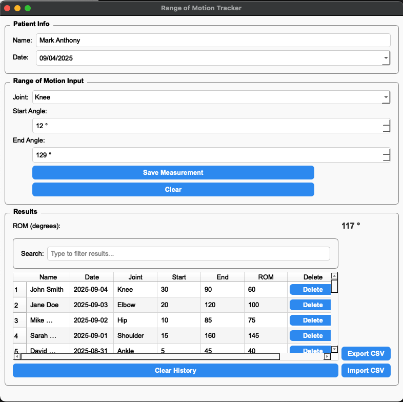

# ROM Tracker

**Range of Motion Tracker for Patients using C++, Qt, and SQLite**

---

## Table of Contents

1. [Project Overview](#project-overview)
2. [Features](#features)
3. [Technologies & Skills Used](#technologies--skills-used)
4. [Installation & Setup](#installation--setup)
5. [Usage](#usage)
6. [Database](#database)
7. [File Import/Export](#file-importexport)
8. [Project Structure](#project-structure)
9. [Screenshot](#screenshot)

---

## Project Overview

ROM Tracker is a desktop application built using C++ and the Qt framework to measure, track, and store the range of motion (ROM) of patients’ joints. Users can save measurements, view them in a dynamic table, filter/search records, and import/export data in CSV format.



---

## Features

* Add and track patient joint measurements (start and end angles).
* Calculate and display Range of Motion (ROM) automatically.
* Clear input fields and reset table history.
* Persistent storage with SQLite database.
* Dynamic table with search/filter functionality.
* Import/export measurements via CSV.
* Styled and user-friendly interface with Qt Widgets and QSS.

---

## Technologies & Skills Used

* **Programming**: C++, Object-Oriented Programming (OOP), structs & classes.
* **GUI**: Qt Framework, Qt Widgets (`QMainWindow`, `QGroupBox`, `QTableWidget`, `QLabel`, `QLineEdit`, `QPushButton`, `QDateEdit`, `QSpinBox`, `QComboBox`).
* **Database**: SQLite via Qt SQL (`QSqlDatabase`, `QSqlQuery`, `QSqlError`).
* **Data Management**: CSV import/export, dynamic table updates.
* **Development Tools**: Qt Creator, Git/GitHub for version control.

---

## Installation & Setup

1. Clone the repository:

   ```bash
   git clone https://github.com/Ant1-dev/ROM_Tracker.git
   ```
2. Open the project in **Qt Creator**.
3. Ensure **Qt Widgets** and **Qt SQL** modules are installed.
4. Build and run the project.
5. The SQLite database `rom_tracker.db` is automatically created in the project directory on first run.

---

## Usage

1. Enter patient information in the **Patient Info** section.
2. Select a joint and specify start/end angles in the **Range of Motion** section.
3. Click **Save** to add the measurement to the history table and database.
4. Use **Clear** to reset the input fields or **Reset History** to clear the table and memory.
5. Filter measurements using the **Search** field in the results section.
6. Export or import measurements via CSV from the **File** menu.

---

## Database

* Uses **SQLite** for local storage.

* Table: `measurements`

  | Column     | Type                              |
  | ---------- | --------------------------------- |
  | id         | INTEGER PRIMARY KEY AUTOINCREMENT |
  | name       | TEXT                              |
  | date       | TEXT                              |
  | joint      | TEXT                              |
  | startAngle | INTEGER                           |
  | endAngle   | INTEGER                           |
  | rom        | INTEGER                           |

* All data persists across application sessions.

---

## File Import/Export

* **Export**: Saves the current measurement history to a CSV file.
* **Import**: Reads measurements from a CSV file and stores them in the SQLite database and table.

---

## Project Structure

```
ROM_Tracker/
├── include/                # Header files
│   ├── database.h
│   ├── mainwindow.h
│   └── measurement.h
├── src/                    # Source files
│   ├── main.cpp
│   ├── mainwindow.cpp
│   ├── database.cpp
│   └── measurement.cpp
├── ui/                     # UI form files
│   └── mainwindow.ui
├── resources/              # QSS styles, icons, etc.
│   └── style.qss
├── rom_tracker.pro          # Qt project file
├── README.md
└── rom_tracker.db           # SQLite database (auto-created)
```
